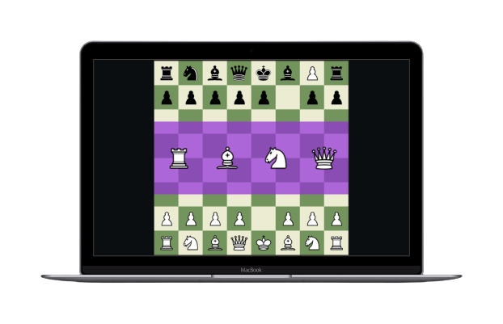

 <h4 align="center" >
Create a Chess Game with ReactJS
</h4>

 <h2 align = 'center'>Frontend Coding</h2>

  <a href="https://api.whatsapp.com/send/?phone=%2B46724037155&text=tja+Jakob+jag+gillade+din+React-react-chess+Clone+&type=phone_number&app_absent=0">Contact   |   </a>
  <a href="https://www.youtube.com/watch?v=Iri__zwxwHg&list=PLBmRxydnERkysOgOS917Ojc_-uisgb8Aj">Inspiration</a>

